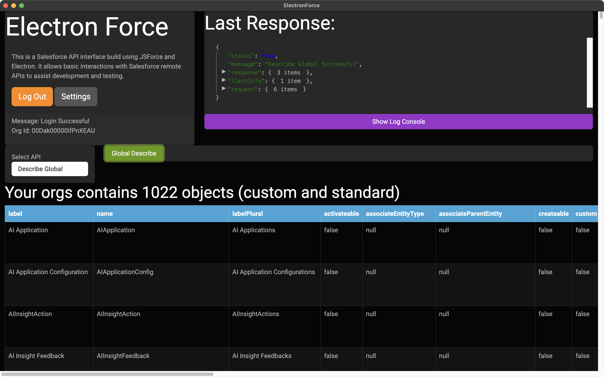
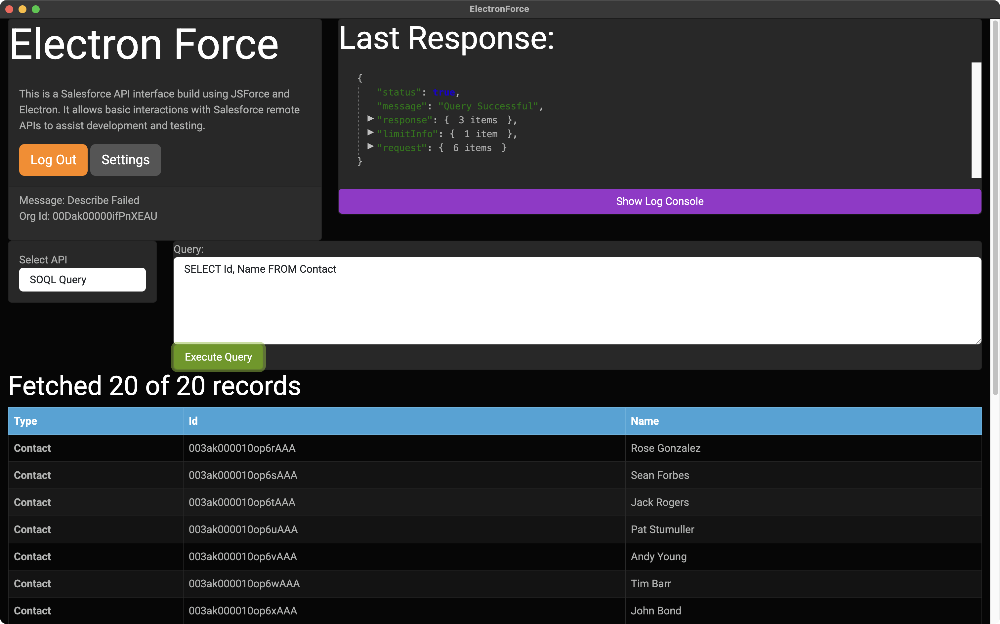
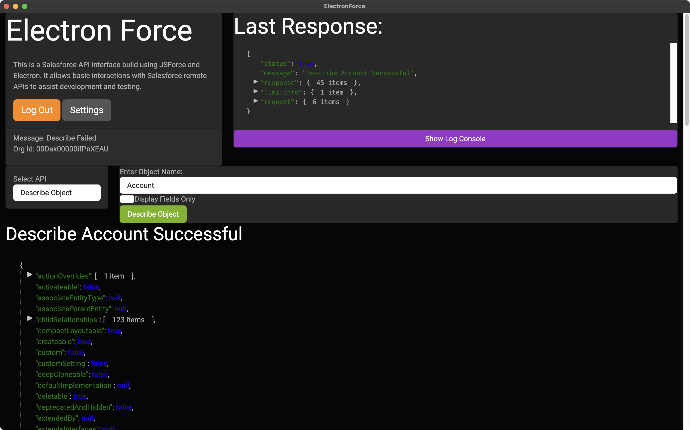

 

# ElectronForce

ElectronForce is an Electron based Salesforce Org exploration tool using the [JSForce](https://jsforce.github.io/) library to leverage the Salesforce APIs. Currently it allows you to query and search data, describe objects, review the Organization object, and list all objects in the org.

## Quick Start

Right now, while the project is setup to build native applications on Mac, Windows, and Linux, I'm not maintaining builds. So it's a bit developer focused and you'll need to have [Node.js installed](https://nodejs.org/en/download/). Granted this is a largely an API interface so some technical ability is expected but longer-term not the ability to understand JavaScript. Anyway you don't need to know how to use Node just need to have the tools around.

From your terminal:

    git clone https://github.com/acrosman/electronForce.git
    cd electronForce
    npm install
    npm start

ElectronForce uses OAuth to connect to your Salesforce Org and interact with the APIs. While all of JSForce's supported APIs are listed, only Query, Search, and Describe are currently supported.

### Setup: Create a Salesforce External Client App

Before connecting ElectronForce to a Salesforce org you need to create an External Client App to generate OAuth credentials:

1. In Salesforce, navigate to **Setup → App Manager** (use Quick Find if needed).
2. Click **New External Client App**.
3. Enter a **Name** and accept or edit the generated **API Name**.
4. Enter a **Contact Email**.
5. Set the **Distribution State** to **Local** (for use only in this org).
6. Save the app, then edit it and enable **OAuth**.
7. In the OAuth settings, set the **Callback URL** to `http://localhost:3835/callback`.
8. Add the following **OAuth Scopes**: `api` and `refresh_token`.
9. Save. Copy the **Consumer Key** (Client ID) and **Consumer Secret** from the OAuth detail page.

For full details see the Salesforce Help article [Create an External Client App](https://help.salesforce.com/s/articleView?id=xcloud.create_a_local_external_client_app.htm&type=5).

### Configure ElectronForce

Open the **Settings** modal in ElectronForce and enter the **Consumer Key** and **Consumer Secret** from your External Client App. If you are connecting to a sandbox org, set the **Login URL** to `https://test.salesforce.com`. For production and Trailhead orgs the default login URL (`https://login.salesforce.com`) can be used.

> **Security note:** Credentials are currently stored in plain text in the application's user-data directory. For a hardened or shared installation, consider upgrading to [`electron.safeStorage`](https://www.electronjs.org/docs/latest/api/safe-storage) for OS-level encryption of stored secrets.

### Connect to Salesforce

Click the **Connect via OAuth** button. ElectronForce will open the Salesforce login page in your default browser. After you approve access, Salesforce redirects to the local callback URL and ElectronForce completes the OAuth handshake automatically.

The main interface includes the API selector and parameter fields on the left, raw display of the previous API response on the right, and a processed version of the response at the bottom.

### Run Query or Search

The SOQL and SOSL Query APIs allow you to run querys and searches using the appropriate Salesforce syntax. When any of the supported APIs are selected appropriate inputs are provided so you can formulate the details of the query. In the screen shot above, a simple Select of Contacts is shown, with a query requesting the record Id and Contact Name.

`SELECT Id, Name FROM Contact`

At the bottom of the display ElectronForce provides a grid view of the query results:

.

_Note: Contacts shown are from a Salesforce Trailhead not from a production database._

### Run Describe

Beyond exploring the data and testing queries, ElectronForce can also allow you to explore the metadata for a specific object provided via the Describe API.  Select the Describe API from the selector and enter the name of the object you would like described.  ElectronForce will format the resulting structures as an interactive tree view.

.

### Run Global Describe

Global Describe retreives a list of all object (custom and standard) in your org.

### Fetch the Organization Object

All Salesforce Orgs have a single object that describes the org itself. This function gets a list of all the fields on your org's Organization object (so it adds new fields as they are released) and runs a SOQL query to retreive all available data. _Note: Not all fields return data via the API._

## Disclaimer

This project has no direct association with Salesforce except the use of the APIs provided under the terms of use of their services.
